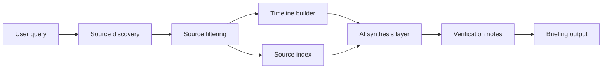

# Ground Truth

**An AI-assisted context engine for understanding how complex events got here.**

Ground Truth is a portfolio project exploring how primary sources, structured timelines, and AI-assisted synthesis can turn noisy geopolitical events into clearer context.

The core idea is simple:

> Most tools tell you what happened. Ground Truth is designed to help explain how it got there.

---

## What this project demonstrates

This repo is meant to show my ability to think through:

- source-driven research workflows
- AI-assisted summarization and synthesis
- timeline and context generation
- API-first product architecture
- credibility, verification, and traceability in AI systems
- product framing for intelligence, research, and analysis tools

This is not positioned as a finished intelligence product. It is an evolving product concept and technical direction for building more transparent AI research systems.

---

## The problem

News, social media, and dashboards are good at showing current events. They are not always good at explaining the deeper chain of causes, incentives, historical decisions, treaties, conflicts, and economic pressures behind those events.

For analysts, students, operators, and curious readers, the hard part is not finding information. The hard part is organizing it into a reliable picture without getting trapped in one narrative.

---

## The concept

Ground Truth is designed around four questions:

1. **What happened?**
2. **What led up to it?**
3. **Which sources support the explanation?**
4. **Where are the uncertainty, gaps, and competing interpretations?**

Instead of treating AI output as the final answer, the system should treat AI as a synthesis layer sitting on top of traceable sources.

---

## Intended workflow

```text
Query/event → source retrieval → timeline construction → context synthesis → source trace → confidence notes
```

A mature version of the system would return:

- a concise briefing
- a historical timeline
- relevant treaties, policy decisions, or economic pressures
- multiple interpretations where appropriate
- citations or source links for key claims
- confidence notes and known gaps

---

## Example use cases

| Use case | Example question |
|---|---|
| Geopolitical context | Why are tensions rising in a specific region? |
| Policy research | What decisions led to the current dispute? |
| Student research | What primary sources explain this event? |
| Analyst workflow | What are the timelines, actors, and incentives? |
| Media literacy | What context is missing from a headline? |

---

## Proposed architecture



---

## Candidate source categories

The long-term design favors authoritative and primary-source material where possible:

- government archives and public records
- treaty and policy databases
- international organization datasets
- conflict event datasets
- economic and development indicators
- declassified historical documents
- congressional or parliamentary research reports

The goal is not to eliminate interpretation. The goal is to make interpretation more visible, sourced, and challengeable.

---

## Possible stack

| Layer | Candidate tools |
|---|---|
| API | Python, FastAPI |
| Data | PostgreSQL, SQLite, pgvector concepts |
| Retrieval | Source connectors, scraping where permitted, public APIs |
| AI layer | Claude, OpenAI, local LLMs via Ollama |
| Frontend | React or lightweight dashboard |
| Output | JSON briefings, timelines, reports, web UI |

---

## Current status

Ground Truth is currently a **public concept and architecture repo**. The README describes the product direction and the kinds of systems thinking behind it. Some implementation details may change as the project matures.

Near-term improvements:

- define a minimal local demo
- add sample source-ingestion script
- add example briefing output
- add source reliability notes
- add a small test dataset
- separate confirmed functionality from future roadmap

---

## Why I built this

My background is in military IT, operations, cybersecurity, and business strategy. I am interested in tools that help people make sense of complex environments without pretending the world is simpler than it is.

Ground Truth is part of that larger pattern: practical AI systems that improve clarity, traceability, and decision-making.

---

## About

Built by **Lawrence Magee** as part of the MAGE Software / Malleus Prendere project ecosystem.

- GitHub: [@lmagee3](https://github.com/lmagee3)
- Profile: [lmagee3](https://github.com/lmagee3)
- Related tool line: [Chaos Monk](https://chaosmonk.netlify.app)

---

## License

MIT unless otherwise noted in future project files.
