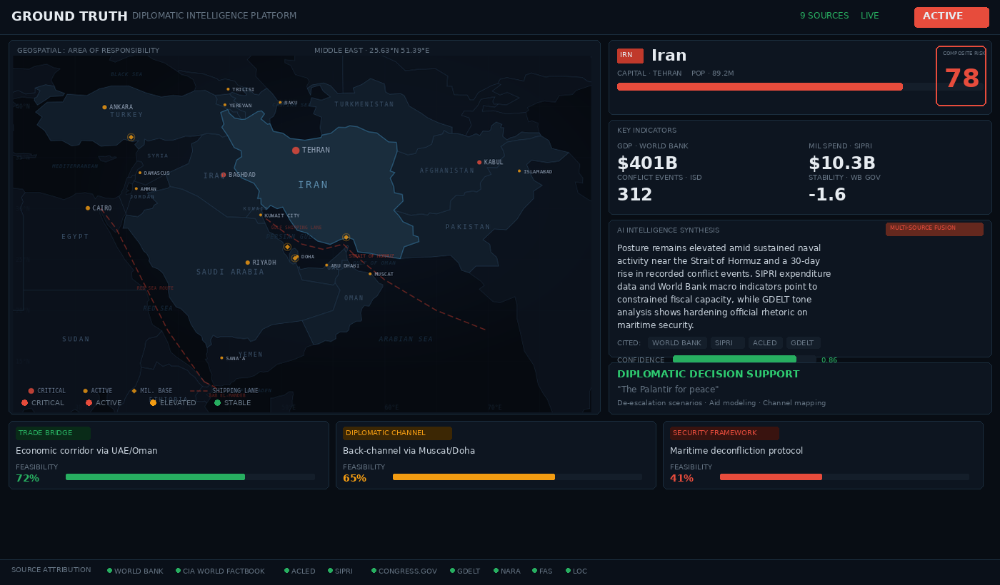

# Ground Truth

**The intelligence briefing behind the radar blip.**

A diplomatic decision-support platform that synthesizes primary authoritative sources into actionable context briefings, de-escalation scenarios, and intervention feasibility scoring.



---

## What Ground Truth Does

Most tools tell you *what* is happening. Ground Truth tells you *why* it's happening and *what to do about it*.

The platform ingests data exclusively from primary authoritative sources — government archives, declassified intelligence, institutional databases, treaty collections, conflict event datasets, and military capability data — and synthesizes it into structured intelligence briefings with full source citations.

**Phase 1 (Complete):** Context engine with 9 primary data sources, AI synthesis, verification pipeline, and bias detection.

**Phase 2 (In Progress):** Recommendation engine for de-escalation scenarios, aid allocation modeling, diplomatic channel mapping, and intervention feasibility scoring. *"The Palantir for peace."*

---

## Core Principles

- **Primary sources only** — no Wikipedia, no news articles, no editorial content
- **Every claim cited** — source URL required for all factual assertions
- **Multiple perspectives** — context reports present competing interpretive frameworks
- **System never picks sides** — presents ranked scenarios with transparent reasoning; human always decides
- **Open-source core** — MIT license for maximum institutional adoption

---

## Data Sources

| Category | Sources |
|----------|---------|
| **US Government** | Library of Congress, National Archives (NARA), Congress.gov, CIA World Factbook, State Dept, OFAC sanctions |
| **International** | World Bank, ACLED conflict events, UCDP, GDELT |
| **Military/Defense** | SIPRI arms transfers & military spending, FAS nuclear notebooks & weapons systems, NATO treaty archives |
| **Phase 2 (adding)** | UN Comtrade, WTO, OECD DAC, UNHCR, FAO, UN Treaty Collection, Freedom House, V-Dem |

---

## Architecture

```
Query → Source Retrieval → Data Summarization → AI Synthesis → Verification Pipeline → Briefing Output
```

| Layer | Stack |
|-------|-------|
| Backend | Python 3.11+ / FastAPI |
| Database | PostgreSQL + pgvector |
| Cache | Redis |
| AI (dev) | Ollama local (zero cost) |
| AI (production) | Claude API (paid tiers only) |
| Frontend | React 18 + TypeScript |
| Hosting | Vercel (frontend) + Railway (API) |

---

## Target Users

- **UN agencies** (UNDP, UNHCR, OCHA) — aid allocation decisions
- **USAID / State Department** — foreign aid strategy, diplomatic planning
- **Think tanks** (Brookings, RAND, CFR, Chatham House) — policy research
- **University IR departments** — teaching and research
- **Defense/policy analysts** — military capability context with SIPRI, FAS, OFAC data

---

## Positioning

**World Monitor** = radar (what is happening now). Real-time event feeds, macro analytics.

**Ground Truth** = analyst's desk (why it's happening, what to do about it). Historical context, primary source citations, recommendation engine.

Integration play: WM users click a hotspot, GT provides the deep briefing and diplomatic options.

---

## Current Status

| Sprint | Status | Shipped |
|--------|--------|---------|
| 1-2 | Done | World Bank, CIA Factbook, GDELT, ACLED, SIPRI, FAS ingestion. DB models, API, Source Validator |
| 3-4 | Done | React frontend, GeoJSON endpoint, Ollama model chain, AI query parser, data summarization pipeline |
| 5 | Done | SSE streaming, two-pass synthesis, depth tier gating, 71 tests passing |
| 6 | In Progress | Library of Congress + Congress.gov + NARA ingestors |
| 7+ | Next | WorldMonitor MCP integration, Phase 2 data sources, recommendation engine v1 |

---

## License

MIT

---

## About

Built by **Lawrence Magee** — CEO, Malleus Prendere LLC. 20-year US Army IT veteran. SDVOSB eligible.

Open-source core distributed under [Chaos Monk](https://chaosmonk.netlify.app).

GitHub: [@lmagee3](https://github.com/lmagee3)
